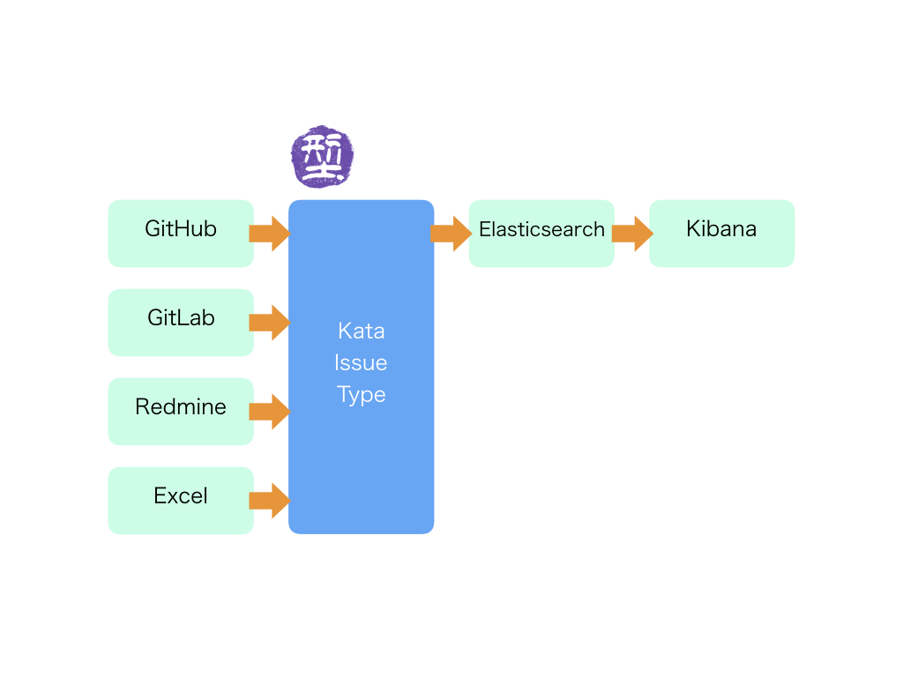
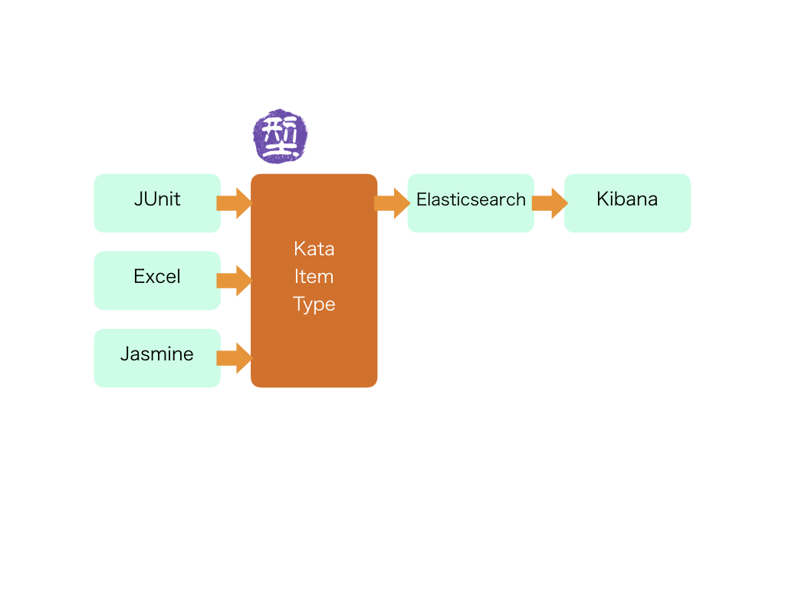

# kata-project


プロジェクトをもっと簡単に計測しよう！

# 1.インストール

```
> npm install kitfactory/kata-project

```

# 2.利用方法:

## 2.1.事前準備

本ツールではNode.js、Elasticserach、Kibanaが必要です。
それぞれを準備しておいてください。

## 2.2.計測コード

わずか数行でプロジェクトが計測できます。JenkinsなどのCIツールで定期スナップを取得するのがおすすめです。

```
var kata = require('kata-project');

kata.initGitLab("http://..../api/v3", key  );
kata.initElastic("localhost",port);
kata.issue.GitLab2Elastic( projectid , "index" );

kata.calc.EvmProject("index",["filter_label"] "dest_index");

```


# 3.説明

kata-projectはプロジェクト計測を簡単にするツールです。kata-projectではプロジェクト計測用に各ツールの共通「データ型」を定義します。そして、各ツールの入力を共通の「データ型」に変換することで様々なツールを横断して、自然とプロジェクトが計測できるようになります。

## 3.1. 例：プロジェクトの進捗の計測





## 3.2. 例：プロジェクトのテストの状況




# 4.共通データ型

## 4.1.Kata-Issue-Type

|項目|内容|
|:--|:--|
|ID|ID|
|title|タイトル|
|description|記載|
|label|ラベル(配列)|
|startdate|開始日|
|duedate|締切日|
|progress|進捗(%)|
|status|open/close|
|assignee|担当者|
|estimation|見積工数|
|json|オリジナルのJSONデータ|

## 4.2.Kata-Item-Type

|項目|内容|
|:--|:--|
|timestamp|時間|
|total|項目数|
|ok|合格項目数|
|ng|NG項目数|
|json|オリジナルJSONのデータ|


## 4.3.Kata-Snapshot-Type

kata.calc.Rankで作成されます。

|項目|内容|
|:--|:--|
|timestamp|時間|
|A|Aの数|
|B|Bの数|
|C|Cの数|
...

## 4.4.Kata-Progress-Type

kata.calc.Progressで作成されます。

|項目|内容|
|:--|:--|
|timestamp|時間|
|total|合計見積|
|planned|timestamp時点計画値|
|progress|timestamp時点実績値|


If you would liket to use cli, use the bellow commands.

```
> kata-github-issues labels=[foo,bar] 
> kata-gitlab-issues labels=[foo,bar]
kata-gitlab-issue
kata-github-issue
kata-aggregate-evm
kata-aggregate-ranking

kata-redmine-issue
kata-excel-issue

kata-junit-test
kata-junit-test
kata-excel-test


kata-encrypt-setting
kata-decrypt-setting
```


